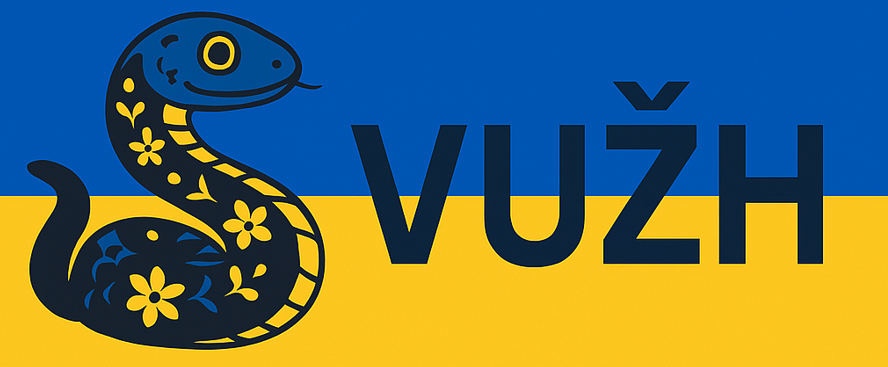

<p align="center">  </p>

# 🐍 ВУЖ — Українська версія мови програмування Python

> **ВУЖ** — це українізована, жартівлива, але цілком функціональна адаптація мови програмування **Python**. У коді використовуються українські змінні, коментарі та стиль, але сама мова — це звичайний Python. Мета — зробити програмування доступнішим, ріднішим та трішечки веселішим 😄

## 📦 ЗМІСТ

1. [Вступ](#-вступ)
2. [Основи синтаксису](#️-основи-синтаксису)
3. [Типи даних](#-типи-даних)
4. [Оператори](#-оператори)
5. [Умовні конструкції](#-умовні-конструкції)
6. [Цикли](#-цикли)
7. [Функції](#️-функції)
8. [Списки, словники та множини](#-списки-словники-та-множини)
9. [Робота з модулями](#-робота-з-модулями)
10. [Ввід/вивід](#️-ввідвивід)
11. [Обробка помилок](#️-обробка-помилок)
12. [Додаткові поради](#-додаткові-поради)
13. [Завершення](#-завершення)
14. [Сумісність](#-сумісність)

## 📘 Вступ

Мова ВУЖ — це просто Python, який "розмовляє українською". Всі ключові слова залишаються англійськими (бо інакше код не працюватиме), але:

- Ідентифікатори (імена змінних, функцій, класів) пишемо українською
- Коментарі теж українською
- Стиль — зрозумілий, легкий, дружній

## ✍️ Основи синтаксису

```python
# Виведення на екран
print("Привіт, світе!")

# Змінна
вік = 25
ім'я = "Оксана"
print(f"Ім'я: {ім'я}, Вік: {вік}")
```

## 🔢 Типи даних

```python
ціле = 10          # int
десяткове = 3.14   # float
рядок = "Привіт"   # str
булеве = True      # bool
список = [1, 2, 3] # list
```

| Тип | Назва по-нашому | Приклад |
|-----|-----------------|---------|
| int | ціле | рахунок = 100 |
| float | десяткове число | ціна = 99.99 |
| str | рядок | слово = "вужик" |
| bool | логічне значення | готовий = False |
| list | список | дні = ["пн", "вт"] |
| dict | словник | дані = {"ключ": 1} |
| set | множина | унікальні = set() |

## 🧮 Оператори

```python
# Арифметика
a = 5
b = 2
print(a + b)  # додавання
print(a - b)  # віднімання
print(a * b)  # множення
print(a / b)  # ділення
print(a % b)  # остача
print(a ** b) # піднесення до степеня

# Порівняння
print(a == b) # дорівнює
print(a != b) # не дорівнює
print(a > b)  # більше
print(a < b)  # менше
```

## 🧠 Умовні конструкції

```python
# Простий if
вік = 17

if вік >= 18:
    print("Повнолітній")
else:
    print("Ще молодий")

# if-elif-else
бал = 87

if бал >= 90:
    print("Оцінка: A")
elif бал >= 80:
    print("Оцінка: B")
else:
    print("Треба постаратись ще")
```

## 🔁 Цикли

```python
# for
для = ["яблуко", "груша", "слива"]

for фрукт in для:
    print("Фрукт:", фрукт)

# while
лічильник = 0

while лічильник < 3:
    print("Раз:", лічильник)
    лічильник += 1
```

## 🛠️ Функції

```python
def привітай(ім'я):
    print(f"Привіт, {ім'я}!")

привітай("Світлана")

# Функція з поверненням значення
def додай(а, б):
    return а + б

результат = додай(3, 4)
print("Сума:", результат)
```

## 📚 Списки, словники та множини

```python
# Список
товари = ["хліб", "молоко", "сир"]
print(товари[0])

# Словник
користувач = {"ім'я": "Ігор", "вік": 30}
print(користувач["вік"])

# Множина
унікальні = set([1, 2, 2, 3])
print(унікальні)
```

## 📦 Робота з модулями

```python
import random

випадкове = random.randint(1, 100)
print("Число від 1 до 100:", випадкове)
```

## 🖥️ Ввід/вивід

```python
# Ввід від користувача
ім'я = input("Введіть своє ім'я: ")
print(f"Привіт, {ім'я}!")
```

## ⚠️ Обробка помилок

```python
try:
    число = int(input("Введи число: "))
    print("Подвоєне:", число * 2)
except ValueError:
    print("Це не число!")
```

## 📌 Додаткові поради

- Використовуй англійські ключові слова (def, if, for, return) — Python не розуміє "якщо", "повернути", "поки"
- Пиши змінні українською для фану, але без пробілів і лапок: ім'я, вік_користувача
- Використовуй snake_case, навіть у вужівському коді 🐍
- Не забувай коментарі — вони розповідають твоїй майбутній версії, що ти мав на увазі 😄

## 🐍 Завершення

ВУЖ — це не просто код. Це культура. Це стиль. Це спосіб зробити програмування ближчим до серця. Кодь українською, вчи інших, жартуй, і не забувай: головне — щоб працювало 🛠️

## ✅ Сумісність

Увесь код на 100% сумісний із Python 3.x. Можна запускати у VS Code, Jupyter Notebook, PyCharm, або просто в терміналі:

```bash
python main.py
```